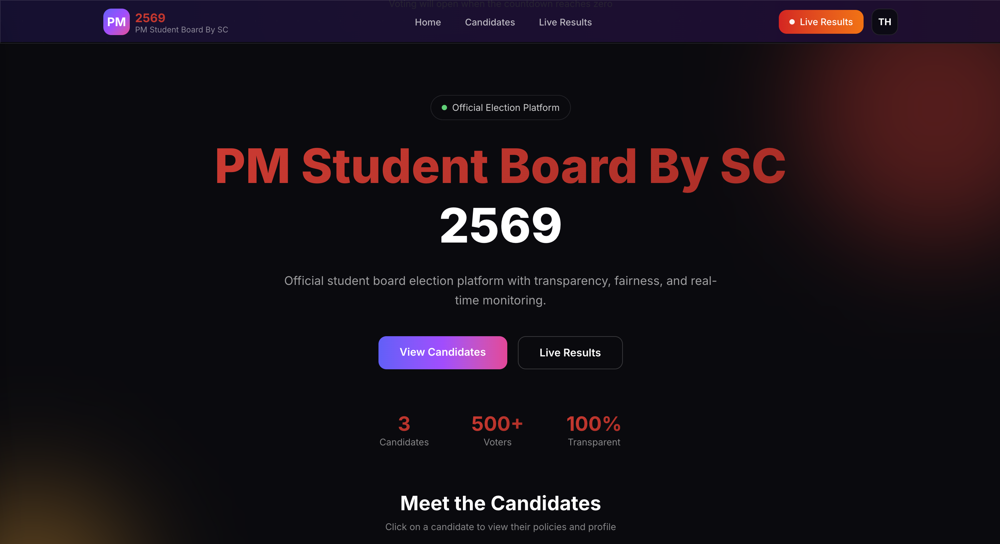

# PM Student Board Elections 2569 🗳️

> **[vote4pm.online](https://vote4pm.online)** - The official, high-performance election platform for the PM Student Board 2569.



## � Overview

This platform is a high-availability, premium web application designed to facilitate transparent and engaging student elections. Built with a "Mobile-First" philosophy and a sleek dark aesthetic, it provides real-time updates, multi-language support, and comprehensive candidate profiles to ensure every voter makes an informed decision.

## 🌟 Key Features

### 🚀 Performance & UI
- **Next.js 15 App Router**: Optimized for speed and SEO.
- **Permanent Dark Theme**: A high-contrast `#0a0a0f` aesthetic tailored for premium readability.
- **Glassmorphic Interactive UI**: Frosted glass effects and micro-animations for an immersive experience.
- **Responsive Design**: Seamlessly transitions from high-resolution desktop displays to hand-held devices.

### �️ Election Infrastructure
- **Live Multilingual Support**: Built-in support for **Thai (Default)** and **English**, managed via a global context.
- **Real-Time Results Engine**: Live vote tracking with real-time percentages and animated progress bars via Firebase.
- **Candidate Ecosystem**: Comprehensive profile pages featuring biographies, policies, and a community "Like" system.
- **Abstain Voting**: Official support for "Abstain" (ไม่ประสงค์ลงคะแนน) votes, integrated into global statistics.
- **Dynamic Countdown**: A precise countdown engine to build anticipation for election day.

### 🛡️ Administrative Suite
- **Secure Management**: Protected admin gateway for election supervisors.
- **Unified Candidate Management**: Full CRUD operations for candidates with an integrated **Image Cropper** (Base64 optimized).
- **Vote Audit Tool**: Manual vote adjustment capabilities for verified tallying.
- **Broadcast Integration**: Instantly embed and toggle Facebook Live streams via the admin panel.

## 🛠️ Technical Implementation

- **Framework**: [Next.js 15.1+](https://nextjs.org/)
- **Styling**: [Tailwind CSS 4.0+](https://tailwindcss.com/)
- **Runtime**: [TypeScript](https://www.typescriptlang.org/)
- **Database/Backend**: [Firebase Firestore](https://firebase.google.com/products/firestore)
- **Analytics**: [Vercel Analytics](https://vercel.com/analytics)
- **Client State**: React Context API & `js-cookie`

## 🚀 Deployment & Setup

### Configuration
The application requires a Firebase project. Create a `.env.local` file with your credentials:
```env
NEXT_PUBLIC_FIREBASE_API_KEY=your_key
NEXT_PUBLIC_FIREBASE_AUTH_DOMAIN=your_project.firebaseapp.com
NEXT_PUBLIC_FIREBASE_PROJECT_ID=your_project
NEXT_PUBLIC_FIREBASE_STORAGE_BUCKET=your_project.appspot.com
NEXT_PUBLIC_FIREBASE_MESSAGING_SENDER_ID=your_id
NEXT_PUBLIC_FIREBASE_APP_ID=your_app_id
```

### Installation
```bash
# Clone and enter
git clone https://github.com/Mink2551/PM-ElectionsWebsiteBySC-2569.git
cd PM-ElectionsWebsiteBySC-2569

# Install & Run
npm install
npm run dev
```

### Production Domain
The platform is optimized for and hosted at:
👉 **[https://vote4pm.online](https://vote4pm.online)**

## 🎨 Design System

| Layer | Hex | Purpose |
|-------|-----|---------|
| **Core Background** | `#0a0a0f` | Primary canvas |
| **Identity Red** | `#EF4444` | Student Board primary identity |
| **Accent Pink** | `#EC4899` | CTA and focus elements |
| **Accent Yellow** | `#F59E0B` | Warning and highlight states |

## 📄 License

This project is open-source and available under the **MIT License**.

---
*Developed with ❤️ by the Student Board Technical Team.*
